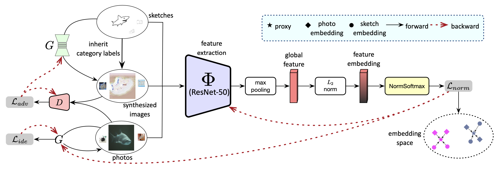

# ACNet

A PyTorch implementation of ACNet based on TCSVT 2023 paper
[ACNet: Approaching-and-Centralizing Network for Zero-Shot Sketch-Based Image Retrieval](https://ieeexplore.ieee.org/document/10052737).



## Requirements

- [Anaconda](https://www.anaconda.com/download/)
- [PyTorch](https://pytorch.org)

```
conda install pytorch=1.10.0 torchvision cudatoolkit=11.3 -c pytorch
```

- [Timm](https://rwightman.github.io/pytorch-image-models/)

```
pip install timm
```

- [Pytorch Metric Learning](https://kevinmusgrave.github.io/pytorch-metric-learning/)

```
conda install pytorch-metric-learning -c metric-learning -c pytorch
```

## Dataset

[Sketchy Extended](http://sketchy.eye.gatech.edu) and
[TU-Berlin Extended](http://cybertron.cg.tu-berlin.de/eitz/projects/classifysketch/) datasets are used in this repo, you
could download these datasets from official websites, or download them from
[Google Drive](https://drive.google.com/drive/folders/1lce41k7cGNUOwzt-eswCeahDLWG6Cdk0?usp=sharing). The data directory
structure is shown as follows:

 ```
├──sketchy
   ├── train
       ├── sketch
           ├── airplane
               ├── n02691156_58-1.jpg
               └── ...
           ...
       ├── photo
           same structure as sketch
   ├── val
      same structure as train
      ...
├──tuberlin
   same structure as sketchy
   ...
```

## Usage

### Train Model

```
python train.py --data_name tuberlin
optional arguments:
--data_root                   Datasets root path [default value is '/home/data']
--data_name                   Dataset name [default value is 'sketchy'](choices=['sketchy', 'tuberlin'])
--backbone_type               Backbone type [default value is 'resnet50'](choices=['resnet50', 'vgg16'])
--emb_dim                     Embedding dim [default value is 512]
--batch_size                  Number of images in each mini-batch [default value is 64]
--epochs                      Number of epochs over the model to train [default value is 10]
--warmup                      Number of warmups over the extractor to train [default value is 1]
--save_root                   Result saved root path [default value is 'result']
```

### Test Model

```
python test.py --num 8
optional arguments:
--data_root                   Datasets root path [default value is '/home/data']
--query_name                  Query image name [default value is '/home/data/sketchy/val/sketch/cow/n01887787_591-14.jpg']
--data_base                   Queried database [default value is 'result/sketchy_resnet50_512_vectors.pth']
--num                         Retrieval number [default value is 5]
--save_root                   Result saved root path [default value is 'result']
```

## Benchmarks

The models are trained on one NVIDIA GTX TITAN (12G) GPU. `Adam` is used to optimize the model, `lr` is `1e-5`
for backbone, `1e-3` for generator and `1e-4` for discriminator. all the hyper-parameters are the default values.

<table>
<thead>
  <tr>
    <th rowspan="3">Backbone</th>
    <th rowspan="3">Dim</th>
    <th colspan="4">Sketchy Extended</th>
    <th colspan="4">TU-Berlin Extended</th>
    <th rowspan="3">Download</th>
  </tr>
  <tr>
    <td align="center">mAP@200</td>
    <td align="center">mAP@all</td>
    <td align="center">P@100</td>
    <td align="center">P@200</td>
    <td align="center">mAP@200</td>
    <td align="center">mAP@all</td>
    <td align="center">P@100</td>
    <td align="center">P@200</td>
  </tr>
</thead>
<tbody>
  <tr>
    <td align="center">VGG16</td>
    <td align="center">64</td>
    <td align="center">32.6</td>
    <td align="center">38.0</td>
    <td align="center">48.7</td>
    <td align="center">44.7</td>
    <td align="center">39.8</td>
    <td align="center">37.1</td>
    <td align="center">50.6</td>
    <td align="center">48.0</td>
    <td align="center"><a href="https://mega.nz/file/fO53GAbJ#Pa_IXv3u3pv603adES4UR0K3Z44xJ8EnQu3xC0MfQbk">MEGA</a></td>
  </tr>
  <tr>
    <td align="center">VGG16</td>
    <td align="center">512</td>
    <td align="center">38.3</td>
    <td align="center">42.2</td>
    <td align="center">53.3</td>
    <td align="center">49.3</td>
    <td align="center">47.2</td>
    <td align="center">43.9</td>
    <td align="center">58.1</td>
    <td align="center">55.3</td>
    <td align="center"><a href="https://mega.nz/file/7HgizBpS#_3q6E6V5afuUzdUbYoEG_5qLK9a9Jz8lFm_DXpR-tSo">MEGA</a></td>
  </tr>
  <tr>
    <td align="center">VGG16</td>
    <td align="center">4096</td>
    <td align="center"><b>40.0</b></td>
    <td align="center"><b>43.2</b></td>
    <td align="center"><b>54.6</b></td>
    <td align="center"><b>50.8</b></td>
    <td align="center"><b>51.7</b></td>
    <td align="center"><b>47.9</b></td>
    <td align="center"><b>62.3</b></td>
    <td align="center"><b>59.3</b></td>
    <td align="center"><a href="https://mega.nz/file/7XoAAIJJ#STEnjlFg3Iy3OmFxP6XDvU7oMRnuzh4vO-Ss7AJ_Q14">MEGA</a></td>
  </tr>
  <tr>
    <td align="center">ResNet50</td>
    <td align="center">64</td>
    <td align="center">43.0</td>
    <td align="center">46.0</td>
    <td align="center">56.8</td>
    <td align="center">52.7</td>
    <td align="center">47.5</td>
    <td align="center">44.9</td>
    <td align="center">57.2</td>
    <td align="center">54.9</td>
    <td align="center"><a href="https://mega.nz/file/nDADgCSQ#7Ov9VM-3w9fgn72r0r5yO7bflW1UOLCS0q5j7j0_Bmc">MEGA</a></td>
  </tr>
  <tr>
    <td align="center">ResNet50</td>
    <td align="center">512</td>
    <td align="center"><b>51.7</b></td>
    <td align="center"><b>55.9</b></td>
    <td align="center"><b>64.3</b></td>
    <td align="center"><b>60.8</b></td>
    <td align="center"><b>57.7</b></td>
    <td align="center">57.7</td>
    <td align="center"><b>65.8</b></td>
    <td align="center"><b>64.4</b></td>
    <td align="center"><a href="https://mega.nz/file/OKJTBKYK#QjiPk9M7OM_3oRTbEIn-q_yZbIeFgRlX_wa0uBEwBCQ">MEGA</a></td>
  </tr>
  <tr>
    <td align="center">ResNet50</td>
    <td align="center">4096</td>
    <td align="center">51.1</td>
    <td align="center">55.7</td>
    <td align="center">63.8</td>
    <td align="center">60.0</td>
    <td align="center">57.3</td>
    <td align="center"><b>58.6</b></td>
    <td align="center">64.6</td>
    <td align="center">63.5</td>
    <td align="center"><a href="https://mega.nz/file/qbxWkSAY#dljUHREcTe3bMltbDXADV-qCm2Ppix-j3Uf7pDnAmJI">MEGA</a></td>
  </tr>
</tbody>
</table>

## Results

