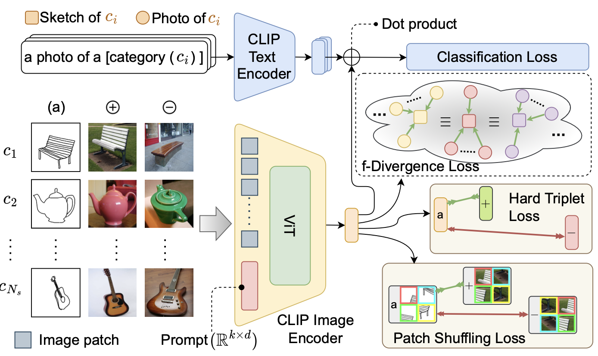
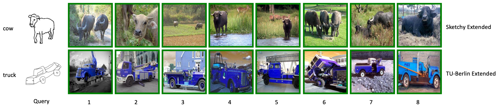

# ClipPrompt

A PyTorch implementation of ClipPrompt based on CVPR 2023 paper
[CLIP for All Things Zero-Shot Sketch-Based Image Retrieval, Fine-Grained or Not](https://openaccess.thecvf.com/content/CVPR2023/html/Sain_CLIP_for_All_Things_Zero-Shot_Sketch-Based_Image_Retrieval_Fine-Grained_or_CVPR_2023_paper.html).



## Requirements

- [Anaconda](https://www.anaconda.com/download/)
- [PyTorch](https://pytorch.org)

```
conda install pytorch torchvision torchaudio pytorch-cuda=11.8 -c pytorch -c nvidia
```

- [TorchMetrics](https://torchmetrics.readthedocs.io/en/stable/)

```
pip install torchmetrics
```

- [OpenCV](https://opencv.org)

```
pip install opencv-python
```

## Dataset

[Sketchy Extended](http://sketchy.eye.gatech.edu) and
[TU-Berlin Extended](http://cybertron.cg.tu-berlin.de/eitz/projects/classifysketch/) datasets are used in this repo, you
could download these datasets from official websites, or download them from
[Google Drive](https://drive.google.com/drive/folders/1lce41k7cGNUOwzt-eswCeahDLWG6Cdk0?usp=sharing). The data directory
structure is shown as follows:

 ```
├──sketchy
   ├── train
       ├── sketch
           ├── airplane
               ├── n02691156_58-1.jpg
               └── ...
           ...
       ├── photo
           same structure as sketch
   ├── val
      same structure as train
      ...
├──tuberlin
   same structure as sketchy
   ...
```

## Usage

### Train Model

```
python train.py --data_name tuberlin
optional arguments:
--data_root                   Datasets root path [default value is '/home/data']
--data_name                   Dataset name [default value is 'sketchy'](choices=['sketchy', 'tuberlin'])
--backbone_type               Backbone type [default value is 'resnet50'](choices=['resnet50', 'vgg16'])
--proj_dim                    Projected embedding dim [default value is 512]
--batch_size                  Number of images in each mini-batch [default value is 64]
--epochs                      Number of epochs over the model to train [default value is 10]
--warmup                      Number of warmups over the model to train [default value is 1]
--save_root                   Result saved root path [default value is 'result']
```

### Test Model

```
python test.py --num 4
optional arguments:
--data_root                   Datasets root path [default value is '/home/data']
--query_name                  Query image name [default value is '/home/data/sketchy/val/sketch/cow/n01887787_591-14.jpg']
--data_base                   Queried database [default value is 'result/sketchy_resnet50_512_vectors.pth']
--num                         Retrieval number [default value is 8]
--save_root                   Result saved root path [default value is 'result']
```

## Benchmarks

The models are trained on one NVIDIA GeForce RTX 3090 (24G) GPU. `AdamW` is used to optimize the model, `lr` is `1e-5`
and `weight decay` is `5e-4`. all the hyperparameters are the default values.

<table>
<thead>
  <tr>
    <th rowspan="3">Backbone</th>
    <th rowspan="3">Dim</th>
    <th colspan="4">Sketchy Extended</th>
    <th colspan="4">TU-Berlin Extended</th>
    <th rowspan="3">Download</th>
  </tr>
  <tr>
    <td align="center">mAP@200</td>
    <td align="center">mAP@all</td>
    <td align="center">P@100</td>
    <td align="center">P@200</td>
    <td align="center">mAP@200</td>
    <td align="center">mAP@all</td>
    <td align="center">P@100</td>
    <td align="center">P@200</td>
  </tr>
</thead>
<tbody>
  <tr>
    <td align="center">VGG16</td>
    <td align="center">64</td>
    <td align="center">36.1</td>
    <td align="center">39.8</td>
    <td align="center">52.8</td>
    <td align="center">48.1</td>
    <td align="center">44.2</td>
    <td align="center">39.3</td>
    <td align="center">57.1</td>
    <td align="center">53.9</td>
    <td align="center"><a href="https://pan.baidu.com/s/1uGw9MdDVGHYchJ4fXUjIhg">u7qg</a></td>
  </tr>
  <tr>
    <td align="center">VGG16</td>
    <td align="center">512</td>
    <td align="center">42.7</td>
    <td align="center">45.1</td>
    <td align="center">58.9</td>
    <td align="center">53.6</td>
    <td align="center">48.6</td>
    <td align="center">42.8</td>
    <td align="center">60.7</td>
    <td align="center">57.2</td>
    <td align="center"><a href="https://pan.baidu.com/s/1431mOh9jAmXPzKq-o6YYJg">6up4</a></td>
  </tr>
  <tr>
    <td align="center">VGG16</td>
    <td align="center">4096</td>
    <td align="center">44.6</td>
    <td align="center">47.3</td>
    <td align="center">60.1</td>
    <td align="center">55.2</td>
    <td align="center">50.0</td>
    <td align="center">44.1</td>
    <td align="center">61.8</td>
    <td align="center">58.5</td>
    <td align="center"><a href="https://pan.baidu.com/s/1BJMT_nL7YpTkNpKKaHljYQ">hznm</a></td>
  </tr>
  <tr>
    <td align="center">ResNet50</td>
    <td align="center">64</td>
    <td align="center">43.3</td>
    <td align="center">46.6</td>
    <td align="center">58.6</td>
    <td align="center">54.3</td>
    <td align="center">50.7</td>
    <td align="center">47.7</td>
    <td align="center">61.1</td>
    <td align="center">58.5</td>
    <td align="center"><a href="https://pan.baidu.com/s/1xRgFfI74zfH8rX12DcOwEQ">uhkp</a></td>
  </tr>
  <tr>
    <td align="center">ResNet50</td>
    <td align="center">512</td>
    <td align="center">52.6</td>
    <td align="center">55.4</td>
    <td align="center">66.0</td>
    <td align="center">61.7</td>
    <td align="center">58.0</td>
    <td align="center">53.5</td>
    <td align="center">67.5</td>
    <td align="center">65.0</td>
    <td align="center"><a href="https://pan.baidu.com/s/1hkez_L-YtGJss9ngkmvbTg">u8ct</a></td>
  </tr>
  <tr>
    <td align="center">ResNet50</td>
    <td align="center">2048</td>
    <td align="center">53.7</td>
    <td align="center">56.8</td>
    <td align="center">66.4</td>
    <td align="center">62.5</td>
    <td align="center">60.4</td>
    <td align="center">56.1</td>
    <td align="center">69.4</td>
    <td align="center">67.1</td>
    <td align="center"><a href="https://pan.baidu.com/s/1uMsoU2A31MFnfMZmBsL0Xw">ipr3</a></td>
  </tr>
</tbody>
</table>

## Results

