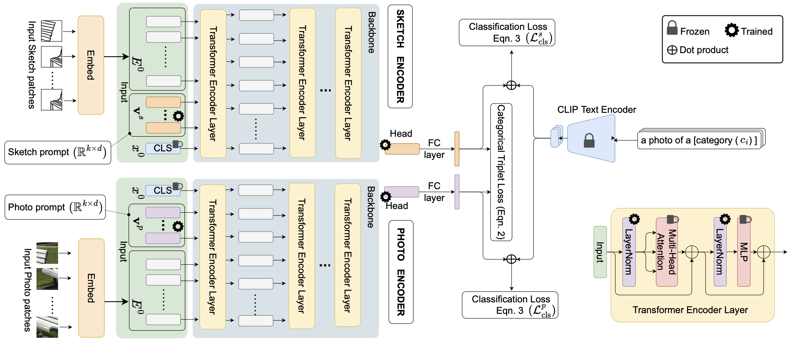

# ClipPrompt

A PyTorch implementation of ClipPrompt based on CVPR 2023 paper
[CLIP for All Things Zero-Shot Sketch-Based Image Retrieval, Fine-Grained or Not](https://openaccess.thecvf.com/content/CVPR2023/html/Sain_CLIP_for_All_Things_Zero-Shot_Sketch-Based_Image_Retrieval_Fine-Grained_or_CVPR_2023_paper.html).



## Requirements

- [Anaconda](https://www.anaconda.com/download/)
- [PyTorch](https://pytorch.org)

```
conda install pytorch torchvision torchaudio pytorch-cuda=11.8 -c pytorch -c nvidia
```

- [TorchMetrics](https://torchmetrics.readthedocs.io/en/stable/)

```
pip install torchmetrics
```

- [OpenCV](https://opencv.org)

```
pip install opencv-python
```

## Dataset

[Sketchy Extended](http://sketchy.eye.gatech.edu) and
[TU-Berlin Extended](http://cybertron.cg.tu-berlin.de/eitz/projects/classifysketch/) datasets are used in this repo, you
could download these datasets from official websites, or download them from
[Google Drive](https://drive.google.com/drive/folders/1lce41k7cGNUOwzt-eswCeahDLWG6Cdk0?usp=sharing). The data directory
structure is shown as follows:

 ```
├──sketchy
   ├── train
       ├── sketch
           ├── airplane
               ├── n02691156_58-1.jpg
               └── ...
           ...
       ├── photo
           same structure as sketch
   ├── val
      same structure as train
      ...
├──tuberlin
   same structure as sketchy
   ...
```

## Usage

### Train Model

```
python train.py --data_name tuberlin
optional arguments:
--data_root                   Datasets root path [default value is '/home/data']
--data_name                   Dataset name [default value is 'sketchy'](choices=['sketchy', 'tuberlin'])
--proj_dim                    Projected embedding dim [default value is 512]
--batch_size                  Number of images in each mini-batch [default value is 64]
--epochs                      Number of epochs over the model to train [default value is 10]
--save_root                   Result saved root path [default value is 'result']
--query_name                  Query image name [default value is '/home/data/sketchy/val/sketch/cow/n01887787_591-14.jpg']
--num                         Retrieval number [default value is 8]
```

## Benchmarks

The models are trained on one NVIDIA GeForce RTX 3090 (24G) GPU. `seed` is `42`, `prompt_lr` is `1e-3`
and `distance function` is `1.0 - F.cosine_similarity(x, y)`, the other hyper-parameters are the default values.

<table>
<thead>
  <tr>
    <th rowspan="3">Dataset</th>
    <th rowspan="3">Prompt Num</th>
    <th rowspan="3">mAP@200</th>
    <th rowspan="3">mAP@all</th>
    <th rowspan="3">P@100</th>
    <th rowspan="3">P@200</th>
    <th rowspan="3">Download</th>
  </tr>
</thead>
<tbody>
  <tr>
    <td align="center">Sketchy Extended</td>
    <td align="center">3</td>
    <td align="center">36.1</td>
    <td align="center">39.8</td>
    <td align="center">52.8</td>
    <td align="center">48.1</td>
    <td align="center"><a href="https://pan.baidu.com/s/1uGw9MdDVGHYchJ4fXUjIhg">u7qg</a></td>
  </tr>
  <tr>
    <td align="center">TU-Berlin Extended</td>
    <td align="center">3</td>
    <td align="center">36.1</td>
    <td align="center">39.8</td>
    <td align="center">52.8</td>
    <td align="center">48.1</td>
    <td align="center"><a href="https://pan.baidu.com/s/1uGw9MdDVGHYchJ4fXUjIhg">u7qg</a></td>
  </tr>
</tbody>
</table>

## Results

